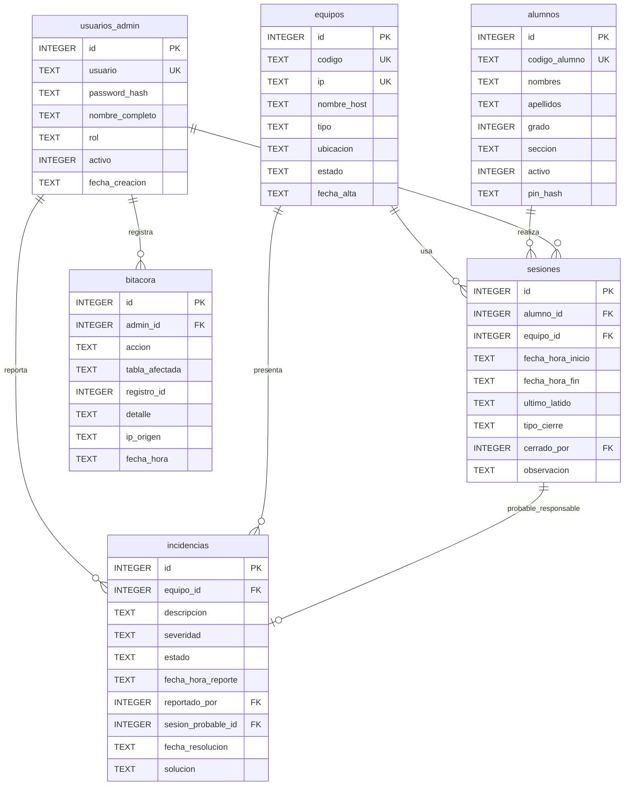

# Diagrama entidad-relación (Mermaid)

```mermaid
erDiagram
    equipos ||--o{ sesiones : usa
    alumnos ||--o{ sesiones : realiza
    usuarios_admin ||--o{ sesiones : cierra
    usuarios_admin ||--o{ incidencias : reporta
    equipos ||--o{ incidencias : presenta
    sesiones ||--o| incidencias : probable_responsable
    usuarios_admin ||--o{ bitacora : registra

    equipos {
        INTEGER id PK
        TEXT codigo UK
        TEXT ip UK
        TEXT nombre_host
        TEXT tipo
        TEXT ubicacion
        TEXT estado
        TEXT fecha_alta
    }

    alumnos {
        INTEGER id PK
        TEXT codigo_alumno UK
        TEXT nombres
        TEXT apellidos
        INTEGER grado
        TEXT seccion
        INTEGER activo
        TEXT pin_hash
    }

    usuarios_admin {
        INTEGER id PK
        TEXT usuario UK
        TEXT password_hash
        TEXT nombre_completo
        TEXT rol
        INTEGER activo
        TEXT fecha_creacion
    }

    sesiones {
        INTEGER id PK
        INTEGER alumno_id FK
        INTEGER equipo_id FK
        TEXT fecha_hora_inicio
        TEXT fecha_hora_fin
        TEXT ultimo_latido
        TEXT tipo_cierre
        INTEGER cerrado_por FK
        TEXT observacion
    }

    incidencias {
        INTEGER id PK
        INTEGER equipo_id FK
        TEXT descripcion
        TEXT severidad
        TEXT estado
        TEXT fecha_hora_reporte
        INTEGER reportado_por FK
        INTEGER sesion_probable_id FK
        TEXT fecha_resolucion
        TEXT solucion
    }

    bitacora {
        INTEGER id PK
        INTEGER admin_id FK
        TEXT accion
        TEXT tabla_afectada
        INTEGER registro_id
        TEXT detalle
        TEXT ip_origen
        TEXT fecha_hora
    }
```
